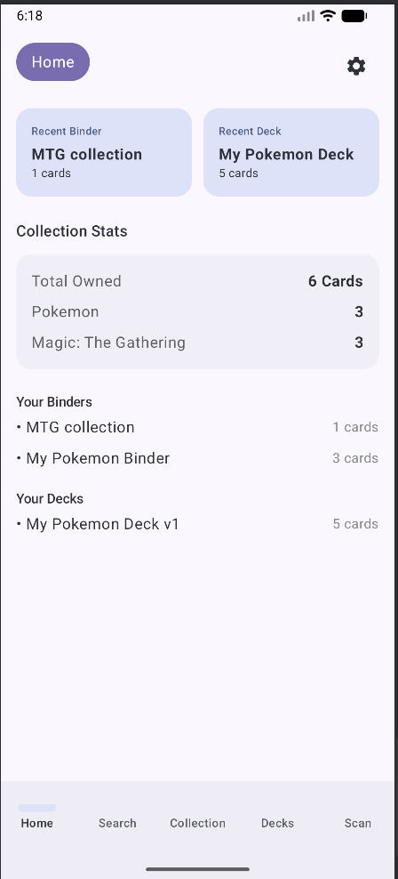
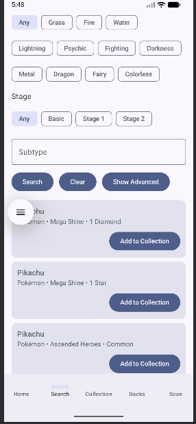
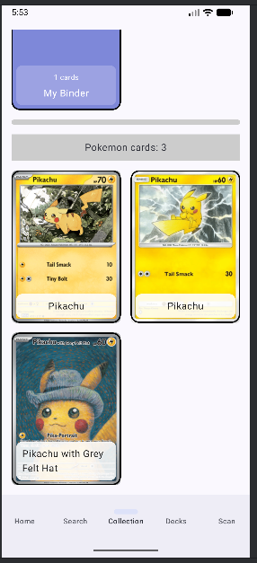

# CS3180_SP2026_Project_G09

## Team Information: Names, emails, chosen roles
Michael Fattizzo, mfattiz@bgsu.edu, Project Lead

Jacob Rowe, rejacob@bgsu.edu, Backend/Data

Logan Pavelschak, lpavels@bgsu.edu, Quality Assurance 

-Note that UI/UX is already designed in Michael's prototype report, and we will take turns on contributing any additional work needed for that role.

Setup instructions at bottom of this file, after the feasibility assessment.

## Project Title and Description: 2-3 paragraphs explaining your app idea
Title: TCG Tracker

Problem Statement - TCGs (Trading Card Games) have massive amounts of information that need to be cataloged, and as an active TCG player, there is a clear lack of software to help order all this information in one place. And it gets even worse the more different TCGs you are involved with.

Problem Description - Each different TCG has tens if not hundreds of thousands of unique cards without even speaking about reprints alt arts, and it isn’t guaranteed that an individual would only pull one copy of a card or only want one copy. Unfortunately, there are no current apps that allow for a high-quality experience across multiple TCGs. Due to the highly complex nature of each TCG, the apps that do allow for the cataloging of cards are specialized for one certain TCG and tend to only be accessed through a mobile device.

Proposed Solution - Through the creation of an app individuals will be able to track the state of, add, view, or modify their collections for any TCG they play or collect at any time. The goal of the app, as stated earlier, is to facilitate the record keeping of players’ cards within their collection, as well as categorize them based on details, such as attack and defense points found on certain card collections.


## Target Users: Who will use this app and why?
This project would target active players and collectors who possess large quantities of playing cards and struggle to organize and keep track of the cards in their collection. People who are looking for a certain card might find it challenging to know if it is one they own and, if they do, where it is located; this app would allow them to both know they have it and where it is located in their collection.

## Core Features: List 5-8 main features
    1: Add cards to a virtual binder
    2: Search different TCGs for certain cards
    3: Filter collections to find cards of a certain type
    4: Scan a real card to add it virtually 
    5: Make and alter multiple different sub collections of the larger total collection


## Technology Stack: Confirm you'll use required technologies
The scope of the app is well within the realm of needing to make full use of all required technologies

## Initial Mockups: Hand-drawn sketches or digital wireframes of 3-4 key screens
There is a image file on the gitLab with a prototype of multiple screens 

Depending on time constraints, we may decide to omit the feature to allow filtering by price and calculating a total estimated value for the user's collection.

## Feasibility Assessment: Why is this achievable in 9 weeks?
A large amount of the UI planning and early development ideas have been completed in another class so only the coding and testing need to be completed this greatly cuts down on the time needed to build this project. There are many features that would be considered what if features that would only be added if there is time but the core functionality of the app is simple and straight forward and should prove easy to complete within the span of 9 weeks. 

## Setup/Usage Instructions 

### 1) Requirements
- Android Studio: recent stable version with Gradle support (specifically runs well on "Android Studio Otter 2 Feature Drop | 2025.2.2 Patch 1")
- JDK: 21 (specifically ran well with JetBrains Runtime 21.0.8)
- Android SDK Compile/Target: API 36 (specifically ran well with Android 16 emulator with 36.1 SDK)


### 2) Clone the repository
- regular git clone command from main:
```bash
git clone git@gitlab.com:MFatt/cs3180_sp2026_project_g09.git
```

### 3) Open the project
- Open Android Studio.
- Choose Open and select the folder: `TCG app code`.
- Let Gradle sync complete.

### 4) API key configuration
Currently the app integrates with the Scrydex API for card data, which requires an API key and team ID. It is a paid membership and we are not uploading the API keys to version control. Reach out to Michael Fattizzo for access to test the real API calls.

Once you get the API key and team ID, you will need to add them to the `local.properties` file in the root of the project. Example `local.properties` content:
```properties
SCRYDEX_API_KEY= 47efe06963add67f8d39989b644c2efc2e4aeb9d0a5e317ef5625a9a5699c95f
SCRYDEX_TEAM_ID= cardhub
```

Then the app should compile and work with real API calls instead of mock data!

If you want to run the app with mock data instead of the Real API calls, you can skip the above step, but you will need to re-enable the following lines in the repositories to allow the app to use the mock data instead of the real API calls:
- In SearchRepository.kt, lines 17-19 and 37-66
- In CardRepository.kt, lines 37-42 and 72-275
They are marked with comments that say "// TODO: comment out..." 

After enabling mock data, you can search "mock" in either category in the Search screen to find mock cards to add to your collection and test the app's functionality without needing real API access.


### 5) Build and run the app in Android Studio using the emulator

- Select an emulator/device (SDK 36.1 or similar) from the device dropdown.
- Run app from Android Studio.

### 6) Troubleshooting
- If Gradle sync fails, confirm JDK 21 is selected in Android Studio.
- If build fails on missing Scrydex values, check `local.properties` contains both keys. Also don't forget to comment out the lines as mentioned in step 5!
- If you have any issues, reach out to Michael Fattizzo for help with API access.

### 7) How to use the app
- Use the bottom navigation to switch between Home, Search, Collection, Decks, and Scan screens.
- Note that the Home and Scan screens are placeholders for now, but Search, Collection, and Decks have core functionality implemented.
- In Search, you can search for cards by name and add them to your collection. If you are running mock data, search "Mock" in either category to find mock cards. At the bottom, you will see search results. Add them to your total collection, and then you can view them in the Collection tab. Once added to the total collection for a given game, the cards are saved to the local database and will persist across app restarts.
- In Collection, you can view your owned cards, organized by game type. You can also create and manage binders to store the individual cards. Tap on a card to see its details and manage which binders it is in.
- In Decks, you can create and manage decks of cards. This is still a work in progress.





### 8) How to run test
For the UI tests run the following in a powershell terminal:
`.\gradlew connectedAndroidTest`
For the unit tests run:
`.\gradlew test`

If you don't have the console commands set up, you can also run the tests through Android Studio's test runner. The UI tests are located in `app/src/androidTest/java/com.example.tcgapp` and the unit tests are located in `app/src/test/java/com.example.tcgapp`. You can right click on the folders or individual test files and select "Run tests" to execute them. 
