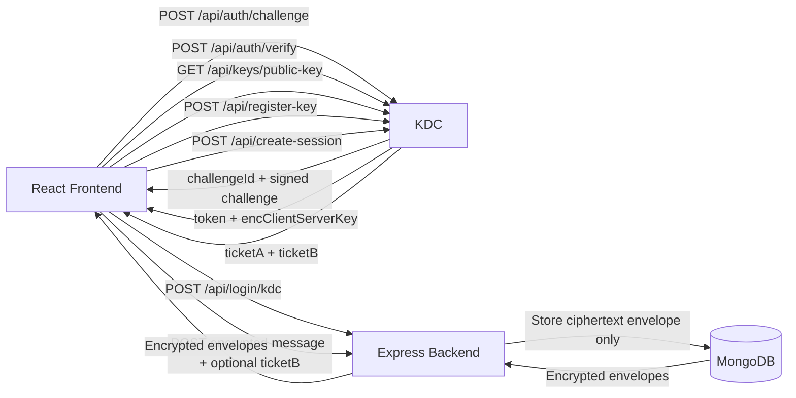

# CS4310 Messaging App

Minimal full-stack direct-messaging app using React + Express with session auth.

## Setup Guide
- For complete local setup (server + client + KDC), use `docs/LOCAL_SETUP_GUIDE.md`.

## Live Deployment
- https://cs4310-messaging-app-35b647f5f3d0.herokuapp.com/

## Heroku Deployment
- This app is configured to run as a single Heroku web process that serves the React build from the Express server.
- The root `Procfile` starts `node server/index.js`.
- The root `heroku-postbuild` step installs `server/` and `client/` dependencies, then builds the client bundle.
- Heroku automatically sets `NODE_ENV=production`; do not override it to `development` in production.

### Required Heroku config vars
- Runtime secrets:
  - `SESSION_SECRET` - required
  - `LOGIN_ID_HMAC_SECRET` - required, keep stable across deploys so login identity mapping does not change
  - `MONGODB_URI` - required for persistent users, conversations, and sessions
  - `PASSWORD_PEPPER` - optional but recommended
  - `ADMIN_USERNAME` - required if you want the seeded admin account
  - `ADMIN_PASSWORD` - required if you want the seeded admin account
  - `ALLOW_RESET=false` - recommended for production
  - `KDC_PROXY_URL=<your deployed KDC base URL>` - required when KDC auth is enabled (used by backend `/api/login/kdc` bootstrap verification)
  - `KDC_PROXY_API_PREFIX=/api` - required unless your KDC uses a different prefix
  - `KDC_AUTH_JWT_PUBLIC_KEY_PEM=<KDC auth signing public key PEM>` - required so backend can verify JWTs
- Client build-time KDC vars:
  - `REACT_APP_KDC_AUTH_ENABLED=true` if the deployed client should use KDC-backed login
  - `REACT_APP_KDC_URL_PROD=https://kdc-simulation.vercel.app`
  - `REACT_APP_KDC_API_PREFIX=/api`
  - `REACT_APP_KDC_USE_PROXY=false`
  - `REACT_APP_KDC_PUBLIC_KEY_PEM_PROD=<KDC auth public key PEM>`

Notes:
- `REACT_APP_*` vars are build-time values; changing them requires a new frontend build/deploy.
- In production, frontend challenge/verify calls are direct to `REACT_APP_KDC_URL_PROD`, while backend bootstrap verification still uses `KDC_PROXY_URL`.

### Recommended Heroku setup flow
1. Create the Heroku app and connect the GitHub repo.
2. Set the runtime config vars above in Heroku Config Vars.
3. Set the client KDC build-time vars before triggering a deploy.
4. Confirm the build log shows the client bundle compiling successfully.
5. Open the deployed app and verify login, session creation, and message loading.

### Production behavior to expect
- The server serves the client build from `client/build`.
- The app uses MongoDB-backed persistence when `MONGODB_URI` is present.
- In its current configuration, MongoDB is required for persistent users, conversations, and sessions.
- Message encryption is now end-to-end via KDC-issued conversation keys (not server-side).
- If `ALLOW_RESET=true`, the admin reset endpoint remains enabled; keep this off in production.
- Successful logins and account changes are logged. Users can view their own activity history via the Dashboard.

## Local First, Then Deploy
- Always test locally first.
- Setup env file first:
  - Command (PowerShell): `Copy-Item server/.env.example server/.env`
  - Command (macOS/Linux): `cp server/.env.example server/.env`
  - Copy `server/.env.example` to `server/.env`
  - Fill in values for:
    - `PORT`
    - `NODE_ENV`
    - `SESSION_SECRET`
    - `MONGODB_URI` (optional until Mongo is enabled)
    - `ADMIN_USERNAME`
    - `ADMIN_PASSWORD`
    - `ALLOW_RESET` (`true` only for testing)
- Run local dev:
  - `npm run dev`
- Production-style check:
  - `npm run build`
  - `npm start`

## Deploy Workflow (Heroku)
- This app is connected to GitHub for automatic Heroku deploys.
- Typical flow (recommended):
  - `git add .`
  - `git commit -m "your message"`
  - `git push origin main`
- Heroku Git remote is optional and only needed if you want direct Heroku pushes:
  - `heroku login`
  - `heroku git:remote -a cs4310-messaging-app-35b647f5f3d0`
  - `git push heroku main`
- Suggested Heroku config vars:
  - `heroku config:set SESSION_SECRET="<strong-random-secret>"`
  - `heroku config:set LOGIN_ID_HMAC_SECRET="<strong-random-secret>"`
  - `heroku config:set MONGODB_URI="<your-atlas-uri>"`
  - `heroku config:set KDC_PROXY_URL="https://kdc-simulation.vercel.app"`
  - `heroku config:set KDC_PROXY_API_PREFIX="/api"`
  - `heroku config:set KDC_AUTH_JWT_PUBLIC_KEY_PEM="<KDC auth signing public key PEM with \\n escapes>"`
  - `heroku config:set ADMIN_USERNAME="admin"`
  - `heroku config:set ADMIN_PASSWORD="<strong-admin-password>"`
  - `heroku config:set ALLOW_RESET="false"`
  - `heroku config:set REACT_APP_KDC_AUTH_ENABLED="true"`
  - `heroku config:set REACT_APP_KDC_URL_PROD="https://kdc-simulation.vercel.app"`
  - `heroku config:set REACT_APP_KDC_API_PREFIX="/api"`
  - `heroku config:set REACT_APP_KDC_USE_PROXY="false"`
  - `heroku config:set REACT_APP_KDC_PUBLIC_KEY_PEM_PROD="<KDC auth public key PEM>"`

### KDC deployment note
- The deployed KDC should expose a dedicated encryption public key for `register-key`.
- Do not use the auth signing key from `/api/auth/public-key` for `register-key` encryption unless the KDC explicitly republishes the matching encryption key there.
- If the KDC only exposes a signing key, `register-key` may fail depending on key-policy/format checks.

## Project Structure
- `client/` React frontend
- `server/` Express backend
- `package.json` root scripts
- `Procfile` Heroku process config

## Next Features (Priority)
1. Add real-time messaging with WebSockets (currently using polling).
2. Implement group chat rooms with multi-party KDC key distribution.
3. Add message expiration (TTL) for ephemeral conversations.

## Security Controls
- Input validation and payload sanitization for login and message routes.
- Password policy enforcement (minimum 8 characters and mixed character classes).
- Password hashing hardening with configurable bcrypt cost and optional pepper.
- Login abuse protection: failed-attempt throttle with 429 responses.
- Messaging abuse protection: per-user send-rate throttle with 429 responses.
- **Hybrid Auth Architecture:** Uses KDC-issued RS256 JWTs for identity verification and `express-session` cookies for persistent state.
- **Session Hardening:** Cookies use `httpOnly` to prevent XSS theft, `sameSite=lax` for CSRF protection, and are marked `secure` in production environments.
- Request body size limit on JSON parsing to reduce oversized payload abuse.
- Message encryption at rest: direct-message content is encrypted using AES-256-GCM before storage.
- **Zero-Knowledge Messaging:** The server stores only encrypted envelopes. It does not have access to conversation keys ($K_{conv}$), which are managed entirely by the KDC and the clients.
- **Identity Obfuscation:** The server identifies users via opaque `loginIdHash` values and random `displayAlias` strings to prevent direct identification of users from database records.
- **Tiered Audit Logging:** The system maintains a global security trail in MongoDB for administrators. Users are provided a "Personal Activity Log" that is strictly filtered to their own randomized identity to prevent information leakage.

## Direct Messaging Architecture
- Users create/open one-on-one conversations with another existing user.
- Messages are scoped to a specific conversation and visible only to that conversation's two participants.
- Dashboard now supports:
  - selecting a user to open a direct conversation
  - viewing conversation list
  - loading/sending messages in the selected one-on-one thread

## Message Encryption (KDC v2)
- Messages are encrypted end-to-end using conversation keys issued by the KDC.
- Each conversation gets a unique conversation key (Kconv) from the KDC establish-session endpoint.
- Messages are never stored in plaintext; the server stores only AES-256-GCM encrypted payloads.
- Clients decrypt messages on-device using their locally-held conversation keys.

## Verification Results (March 31, 2026)
- Build checks passed in development and production-style runs.
- Authentication flow passed: register/login/logout/re-login.
- Messaging flow passed: send and load messages as expected.
- Login abuse checks passed: repeated bad credentials trigger throttle behavior.
- Message abuse checks passed: rapid sends trigger throttle behavior.
- Password policy checks passed: weak passwords rejected, strong passwords accepted.
- Session handling checks passed: expired sessions redirect cleanly to login.
- Safe rendering check passed: HTML/script-like message content renders as inert text.
- Production sanity check passed on `npm start` and `http://localhost:5001`.

## Admin Account + Clear Database Button (For Testing)
- The app supports MongoDB persistence for accounts and messages when `MONGODB_URI` is set.
- The admin account is defined in `server/.env` using:
  - `ADMIN_USERNAME`
  - `ADMIN_PASSWORD`
- This project is currently preconfigured with credentials tied to the project owner for class/demo use:
  - Username: `admin`
  - Password: `admin123`
- For peers: you can run as-is for testing, but use your own credentials for any personal deploy.
- When you log in with the admin account, the Dashboard shows a **Reset Data / Clear Database** button.
- What this button does:
  - Clears all messages
  - Deletes all non-admin user accounts
  - Keeps the admin account
- This action is only allowed when `ALLOW_RESET=true` in `server/.env`.
- Before final/production deploy, set `ALLOW_RESET=false`.

### Quick Peer Test Steps
1. Start app locally: `npm run dev`
2. Log in as `admin` / `admin123`
3. Open Dashboard and click the **Reset Data / Clear Database** button
4. Confirm the prompt to clear test data

## Production Notes
- Set `ALLOW_RESET=false` outside local testing.
- Use a strong random `SESSION_SECRET`.
- Set `MONGODB_URI` for persistent users/messages/sessions.
- Use unique, non-default admin credentials in deployed environments.

## Functions Implemented

Currently implemented functions include the following:

- KDC-backed login and logout flow for user authentication.
- Auto-registration of first-time usernames during login.
- Session state endpoint for frontend auth persistence and route guarding.
- One-on-one direct message conversation creation between two users.
- User directory retrieval for selecting DM recipients.
- Conversation list retrieval for each authenticated user.
- Conversation-specific message retrieval and sending with correct ordering and server-side persistence.
- Admin-only data reset operation for test cleanup that clears non-admin users and messages.
- Dashboard polling flow for ongoing refresh of conversations and messages.
- KDC key registration for each user so the KDC can encrypt conversation tickets for that user.
- KDC conversation session setup so both sides can derive the same `K_conv` for end-to-end encrypted messaging.
- Filtered retrieval of security events (logins, name changes) for the authenticated user.

## Security Features Enforced

Security features enforced by the current implementation include the following:

- AES-256-GCM for encrypting messages before they are stored in the database.
- KDC-issued conversation keys for end-to-end encryption of direct messages.
- Local wrapping of the per-user key with a password-derived key using PBKDF2 and AES-256-GCM.
- Password hashing hardening with bcrypt and a configurable cost factor to control hashing cost.
- Optional password pepper support during hash generation and verification for extra credential security.
- Password strength enforcement for new accounts using minimum length and character diversity requirements.
- Strict input validation and payload sanitization across auth, conversation, and message routes.
- Rejection of dangerous key-patterns to reduce injection-style attacks.
- Failed-login throttling and message send-rate throttling with HTTP 429 responses.
- Generic invalid-credentials responses to reduce account-enumeration risk.
- Session cookie hardening with `httpOnly`, `sameSite=lax`, and environment-aware secure cookies.
- JSON request body size limits to reduce oversized payload abuse.
- Stored messages include ciphertext, IV, auth tag, algorithm, and key version metadata only.
- Audit logs automatically strip sensitive fields (passwords, tokens, proofs) before persistence.
- The backend never stores plaintext conversation messages.

---

## Trusted KDC (Key Distribution Center) Architecture (Implemented)

This app now runs with a deployed KDC-backed flow for login challenge-response, register-key, and create-session ticket issuance.

### Implemented Protocol Summary (The Identity Bridge)

The system uses an "Identity Bridge" pattern: the KDC acts as the Source of Truth for identity, while the App Server manages the application session.

Phase 1:
1. C -> KDC: `POST /api/auth/challenge (idc, ts1, n1)`
2. KDC -> C: `challengeId, salt, iterations, challengeB64, ts2, n1, sig`
3. C -> KDC: `POST /api/auth/verify (idc, challengeId, ts3, n2, ku, verifier, proof)`
4. KDC -> C: `token` (RS256 JWT), `encClientServerKey`
5. C -> S: `POST /api/login/kdc (token, ts5, n3, proof)`
6. C -> KDC: `GET /api/keys/public-key`, then `POST /api/register-key (userId, encryptedUserKey)`

Phase 2:
1. A -> KDC: `POST /api/create-session (tokenA, idB, ts1, n1)`
2. KDC -> A: `ticketA, ticketB`
3. A sends first encrypted message carrying `ticketB`
4. B decrypts `ticketB` using registered recipient key and caches `K_conv`
5. Subsequent messages: `A <-> B: E(K_conv){ Message || TS || Seq# || AuthData }`

### JWT vs. Session Cookies

| Feature | KDC JWT | App Session Cookie |
| :--- | :--- | :--- |
| **Issuer** | Trusted KDC | Messaging App Server |
| **Purpose** | Proves identity to the App Server during login. | Maintains the user's logged-in state for API calls. |
| **Verification** | Verified by Server via KDC Public Key (RS256). | Verified by Server via local `SESSION_SECRET`. |
| **Storage** | Client `sessionStorage`. | Browser Cookie Store (Secure/HttpOnly). |

### Current Runtime Flow Diagram

