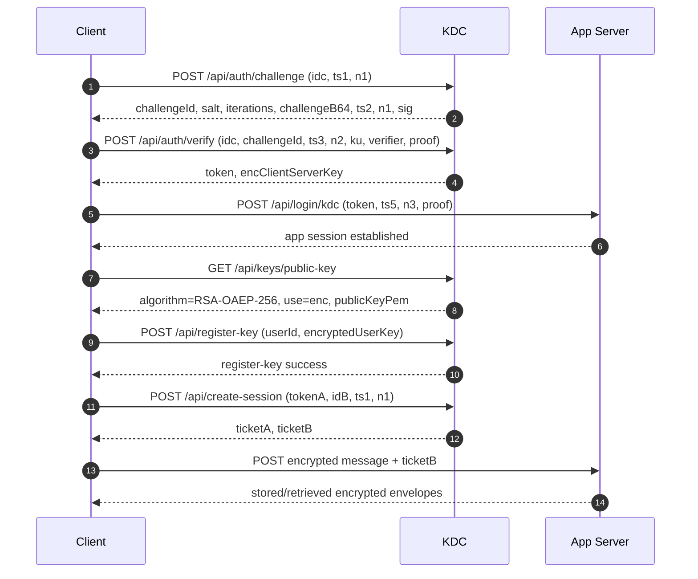

# KDC Architecture and Data Flow

This document describes the implemented KDC v2 flow used by this app.

## Components
- Client (React): computes auth proofs, handles local key wrapping, encrypts/decrypts messages.
- Backend (Express): session bridge (`/api/login/kdc`), API auth, message storage.
- KDC: challenge/verify auth, register-key storage, conversation ticket issuance.

## Phase 1: Authentication and Key Registration

1. C -> KDC (`POST /api/auth/challenge`)
- Payload: `protocolVersion || idc || ts1 || n1`

2. KDC -> C (signed challenge)
- Payload: `challengeId || salt || iterations || challengeB64 || ts2 || n1 || sig`
- Client verifies `sig` with KDC auth signing public key.

3. C -> KDC (`POST /api/auth/verify`)
- Payload: `protocolVersion || idc || challengeId || ts3 || n2 || ku || verifier || proof`
- `challengeId` is issued in step 2 and echoed back here.

4. KDC -> C
- Payload: `token || encClientServerKey`
- `encClientServerKey` is encrypted for client using `K_u` context.

5. C -> S (`POST /api/login/kdc`)
- Payload: `token || ts5 || n3 || HMAC(K_c,s, ts5 || n3)`
- Backend verifies JWT and KDC bootstrap proof, then creates app session.

6. C -> KDC (`GET /api/keys/public-key`, then `POST /api/register-key`)
- Key discovery endpoint: `/api/keys/public-key` must return `algorithm=RSA-OAEP-256`, `use=enc`, `publicKeyPem`.
- Register payload: `protocolVersion || userId || encryptedUserKey`
- `encryptedUserKey = RSA-OAEP-SHA256(publicKeyPem, K_user[32 bytes])` in standard base64.
- KDC stores canonical 32-byte key for authenticated `userId`.

## Phase 2: Conversation Session Establishment

1. A -> KDC (`POST /api/create-session`)
- Payload: `tokenA || idB || ts1 || n1`

2. KDC -> A
- Payload: `ticketA || ticketB`
- `ticketA = E(K_c,s_A, [K_conv || idB || ts2 || lifetime])`
- `ticketB = E(K_user_B, [K_conv || idA || ts2 || lifetime])`

3. A -> B (via app message path)
- First encrypted message carries `ticketB`.

4. B decrypts `ticketB` with `K_user_B`
- B caches `K_conv` and decrypts the conversation payload.

5. Subsequent messages
- `A <-> B: E(K_conv){ Message || TS || Seq# || AuthData }`

## Sequence Diagram

## Storage Notes
- Backend stores encrypted message envelopes only (`iv`, `ciphertext`, `authTag`, algorithm metadata).
- KDC stores canonical recipient key material bound to authenticated user ID.
- Client keeps active keys in session storage and wrapped user key in local storage.

## Verified Runtime Expectations
- `register-key` uses KDC key from `/api/keys/public-key`.
- `encryptedUserKey` decodes to RSA modulus bytes (384 in current RSA-3072 setup).
- `create-session` resolves recipient key by canonical `idB` and issues decryptable `ticketB`.
- Sender and receiver derive matching `K_conv` fingerprints for the same conversation.
