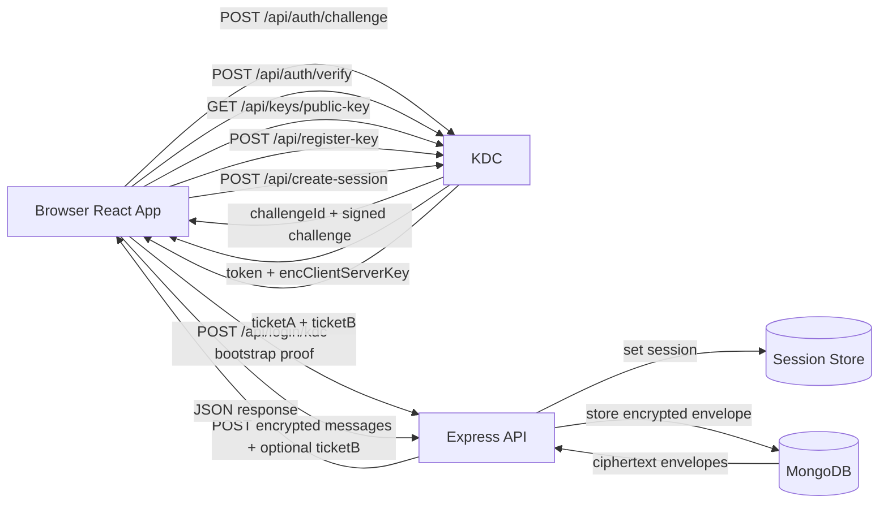
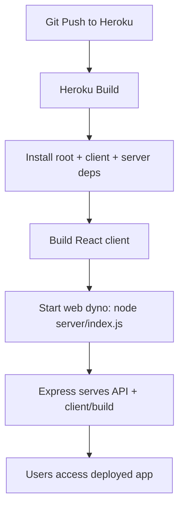
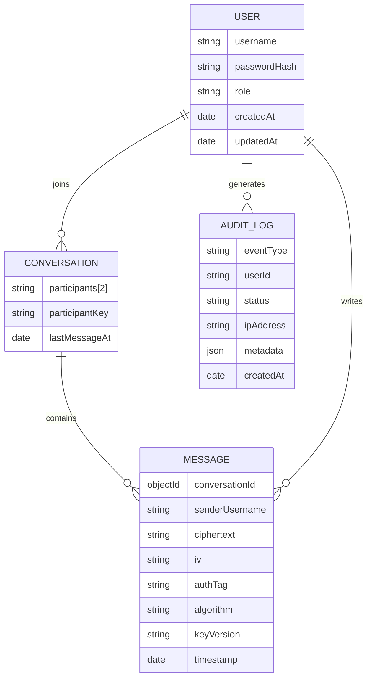

# System Overview

This project is a minimal full-stack direct-messaging app with session-based auth.

## Main Technologies
- **React (client)**: login/dashboard UI, routing, fetch calls.
- **Express (server)**: API routes, auth logic, static file hosting in production.
- **express-session**: server-side session auth via cookies (not JWT).
- **MongoDB + Mongoose**: persistence for users/messages when `MONGODB_URI` is set.
- **connect-mongo**: stores session data in MongoDB for scalable session handling.
- **Heroku**: hosts the Node server and serves built React assets.
- **Audit System**: Fail-safe logging for security events with MongoDB TTL indexing.

## How MongoDB Works Here
When `MONGODB_URI` exists:
1. Server connects to MongoDB at startup.
2. `User` collection stores usernames, password hashes, and roles (`user`/`admin`).
3. `Conversation` collection stores one-on-one participant pairs.
4. `Message` collection stores encrypted direct messages (`ciphertext`, `iv`, `authTag`, metadata).
5. `AuditLog` collection stores system-wide security events with an automatic 90-day expiration (TTL).
5. Session store moves to MongoDB via `connect-mongo`.

When `MONGODB_URI` is missing:
- App falls back to in-memory users/messages (good for local scaffold testing, not persistent).

## Request Flow (Implemented KDC v2)


## Deployment Runtime Flow (Heroku)


## Data Model (Current)


## Heroku + MongoDB Setup (Quick Steps)
1. Create a MongoDB database (recommended: MongoDB Atlas).
2. In Atlas, allow Heroku access (for first test, `0.0.0.0/0`; tighten later).
3. Create a DB user/password and copy connection string.
4. Set Heroku config vars:
   - `SESSION_SECRET`
   - `MONGODB_URI`
   - `ADMIN_USERNAME`
   - `ADMIN_PASSWORD`
   - `ALLOW_RESET=false` (set `true` only during testing)
5. Deploy:
   - `git push heroku main`
6. Verify:
   - `heroku logs --tail`
   - confirm startup logs show MongoDB connection and Mongo session store usage.

## Example Heroku Commands
```bash
heroku config:set SESSION_SECRET="replace-with-long-random-secret"
heroku config:set MONGODB_URI="mongodb+srv://<user>:<pass>@<cluster>/<db>?retryWrites=true&w=majority"
heroku config:set ADMIN_USERNAME="admin"
heroku config:set ADMIN_PASSWORD="replace-this"
heroku config:set ALLOW_RESET="false"
```

## Security Notes
- Keep `ALLOW_RESET=false` in production.
- Never commit `.env`.
- Use strong random secrets and strong admin credentials.
- Enforce least-privilege DB users.
- Message encryption is handled end-to-end via KDC conversation keys; verify KDC key rotation policies.

## Protocol Summary
Phase 1:
1. C -> KDC: `POST /api/auth/challenge (idc, ts1, n1)`
2. KDC -> C: `challengeId, salt, iterations, challengeB64, ts2, n1, sig`
3. C -> KDC: `POST /api/auth/verify (idc, challengeId, ts3, n2, ku, verifier, proof)`
4. KDC -> C: `token, encClientServerKey`
5. C -> S: `POST /api/login/kdc (token, ts5, n3, proof)`
6. C -> KDC: `GET /api/keys/public-key`, then `POST /api/register-key (userId, encryptedUserKey)`

Phase 2:
1. A -> KDC: `POST /api/create-session (tokenA, idB, ts1, n1)`
2. KDC -> A: `ticketA, ticketB`
3. A -> B via app: first encrypted message carries `ticketB`
4. B decrypts `ticketB` with registered recipient key and caches `K_conv`
5. Subsequent messaging: `A <-> B: E(K_conv){ Message || TS || Seq# || AuthData }`

## Abuse Protection Controls
- Login endpoint enforces failed-attempt throttling and returns 429 when limits are exceeded.
- Messaging endpoint enforces per-user send-rate throttling and returns 429 when limits are exceeded.
- Authentication failures use generic credential errors to reduce account-enumeration signal.
- Session cookies are configured with `httpOnly` and `sameSite=lax`, with secure cookies in appropriate environments.
- JSON request parsing uses a body-size limit to reduce oversized payload abuse.

## Verification Checklist
1. Build succeeds with `npm run build`.
2. Development run succeeds with `npm run dev`.
3. Production-style run succeeds with `npm start` and serves app on `http://localhost:5001`.
4. Login/register/logout/re-login flow succeeds.
5. Message send/load flow succeeds.
6. Repeated invalid login attempts trigger throttle behavior.
7. Rapid message sends trigger throttle behavior.
8. Weak password registration is rejected.
9. HTML/script-like message content renders as text (not executable markup).
